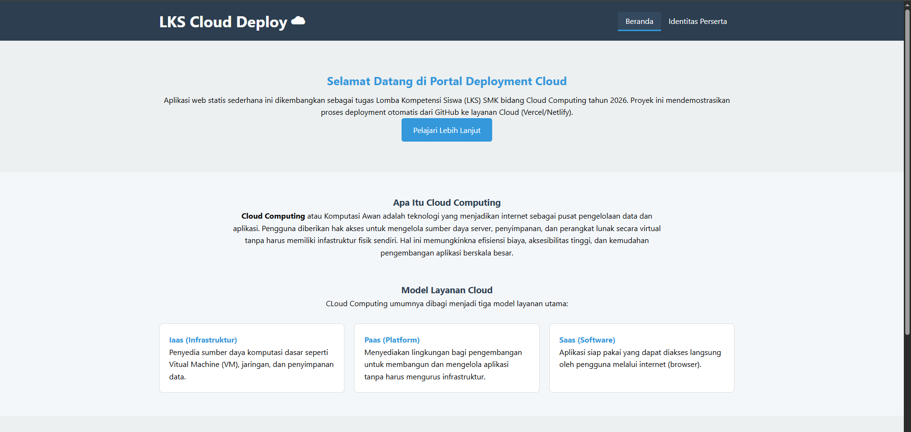
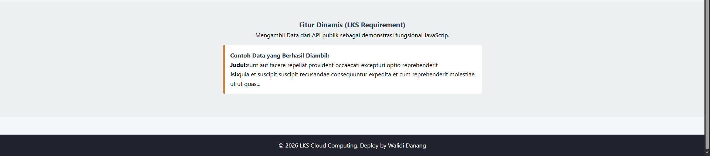
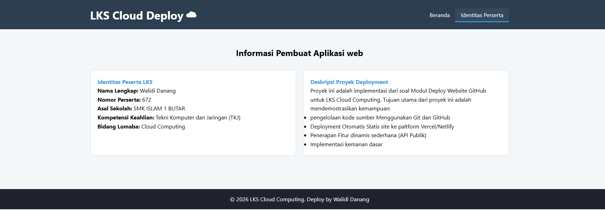

# Web Deployment - LKS Cloud Computing 2026

## 📝 Deskripsi Proyek
Aplikasi ini adalah sebuah website aplikasi statis yang dibangun untuk memenuhi kualifikasi LKS SMK Ma'arif NU Jatim 2026. Proyek ini mendemostrasikan integrasi CI/CD menggunakan GitHub sebagai version Control dan Vercel sebagai Platform-as-a-Service (Paas) 

**Fitur Utama:**
* **Kontent Edukasi**: Penjelasan mengenai Cloud Computing (Iaas, Paas, dan Saas).
* **Fitur Dinamis**: Mengambil data secara asinkron dari API Publik (JSONPlaceholder).
* **Loggging System**: Pemantauan status aplikasi melalaui browser console.
* **Responsive Design**: Tampilan yang optimal di berbagai perangkat.

## 📂 Struktur Folder
Penyusunan file dilakukan secara terorganisir untuk memenuhi standar kualifikasi lomba: 

```text
/lks-cloud-672
├── /css              (Folder khusus stylesheet) 
│   └── style.css     (File desain tampilan utama)
├── /assets           (Folder khusus media/gambar) 
│   ├── image.png     (Screenshot Beranda)
│   ├── image-1.png   (Screenshot Fitur API)
│   └── image-2.png   (Screenshot Halaman About)
├── index.html        (Halaman utama/beranda aplikasi)
├── about.html        (Halaman identitas pembuat)
├── .gitignore        (Keamanan dasar)
└── README.md         (Dokumentasi teknis proyek)

## 🚀 Langkah Deployment
1. **Persiapan Kode**: Pastikan file index.html, about.html, dan style.css sudah siap di folder proyek.
2. **Upload ke GitHub**: Buat repositori baru di GitHub, lalu unggah seluruh file proyek ke dalamnya.
3. **Koneksi Platform Cloud**: Masuk ke akun Vercel/Netlify, pilih "New Project", dan hubungkan dengan repositori GitHub tadi.
4. **Proses Deploy**: Klik tombol Deploy. Platform akan melakukan build otomatis hingga mendapatkan URL publik (HTTPS).
5. **Uji Coba**: Buka link hasil deploy untuk memastikan semua navigasi dan fitur API berfungsi tanpa error.

## 📸 Tampilan Aplikasi
Berikut adalah tampilan antarmuka dari web App LKS Cloud Computing 2026:

## Beranda 

*Menampilkan hero section, Pengertian Cloud Computing, dan model layanan (Iaas, Paas, dan Saas).*

## Fitur API Dinamis 


## Identitas Peserta

*Halaman Identitas peserta LKS dan juga deskripsi proyek deployment.*

## 🔗 Tautan Penting 
* ** Link Repository**: (https://github.com/ptrdanang/lks-cloud-672.git)
* ** Link Web**: (https://lks-cloud-672.vercel.app/)

## ✍ Kendala dan Sousi
1. **Navigasi Error**:

   **Kendala**: Menu "Identitas Peserta" tidak bisa diklik atau File Not Found.

   **Solusi**: Memastikan nama file pada atribut href di HTML sudah sesuai dengan nama file fisik (about.html).
   
2. **Log Tidak Muncul di Konsol**:

   **Kendala**: Log Tidak Muncul: Pesan status di konsol browser tidak terlihat

    **Solusi**: Menambahkan perintah console.log() di bagian fetch API untuk memantau proses loading data